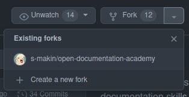
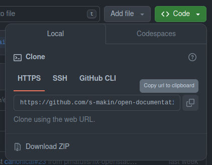
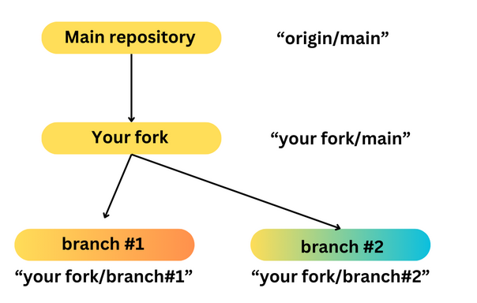

# Working with Git on the command line

There's a few main things to working with Git on the command line.

## The main branch

So far, we've downloaded the main repository onto our machine. The "address" of this repository is usually `origin/main`. We can see this if we type the following command:

```bash
git remote -v 
```


The repository is called "origin" by default (on the left) and the address on GitHub is on the right. By default, we are working on the "main" branch, and when we want to push or pull content, or to submit pull requests, we specify the **address** for where to push/pull from in the format:

```bash
git push origin main
```

This means we want to push to the **origin** repository, and the **main branch** of that repository.

## Setting up your own fork and main branch

It's normal to make a copy of the repository for yourself to work on. We call this a **fork**.

You can make a fork on the GitHub website by navigating to the repository you want to fork, and clicking on the "fork" button.



If you have already made a fork, you'll see it if you click on the little drop-down arrow beside the fork button. You can click on your existing fork to navigate to it. You're now on the main branch of your own fork, instead of the main branch of the origin repository.


As you can see with the example of my fork, in the top left you will be shown which repository your fork comes from. If your fork is out of date with the main repository you'll see a warning that the branch is some number of commits behind the original repository. You can click on the "sync fork" button to fetch those changes and apply them to your own fork. This will bring it up to date.

### Add your fork as a remote

One thing we definitely want to do is to add our own fork as a "remote" repository on the command line. This will allow us to push the changes we want to make from our machine back to the origin repository.

While you're on your fork, click on the green code button, and select the "HTTPS" tab. Copy the URL that's shown there, as in the screenshot below. 



Now return to your Ubuntu terminal and type the following:

```bash
git remote add <your_username> <URL>
```

Make sure you change `<your_username>` to match your GitHub username, and then paste the URL we just copied, before you run the command. 

So as an example, for me to add my own fork as a remote repository on my local machine, I would type:

```
git remote add s-makin https://github.com/s-makin/ubuntu-pro-docs.git
```

And then if I retype the `git remote -v` command, I will see the following output:


If I then wanted to push some changes I made on my local machine to my own fork, I'd use the command `git push s-makin main`.

## How branches work

At this point, I've mentioned branches quite a bit, but let's delve a bit into what they are and why we use them.

Although we can just use our fork to push our changes to, sometimes we might be working on more than one set of changes at a time -- it can get very messy if we try to make different sets of changes in one pull request.

For reviewers especially, it can be very confusing if we just keep piling all our changes onto the main branch. So, we create additional branches to keep all our changes self-contained and tidy.



Let's say we start off with the original repository (which we know has the address `origin/main`). We make a direct copy of it (our fork, which is called `your fork/main`).

At this point, we have some changes we want to work on, so we make a copy of the `your fork/main` branch, which we can call `branch #1`. The "address" of that branch will be `your fork/branch #1`. We can make a bunch of changes to that branch without affecting the contents of the main branch, or the original repository.

Then, let's say we want to start working on some different changes, that are completely unrelated to our work on `branch #1`.

We then go back to `your fork/main` and make another, separate copy of it. This we'll call `branch #2`, which has the address `your fork/branch #2`. Both `branch #1` and `branch #2` started off as copies of the `your fork/main` branch, but as you work on them separate, will come to contain completely different sets of changes.
 
### Working with branches

Branches can be a bit confusing at first, but after you start working with them, they soon make sense!

So, now that you have set up your fork, you've added your remote address locally, and you're on the `main` branch of your fork. Now, we can create a new branch.

```bash
git checkout -b test-branch
```

`checkout` is the command we use to switch between branches, but when we include the `-b` option, we are telling git to also create the `test-branch` branch at the same time. Usually, we will use separate branches for every pull request we intend to submit, so we can keep things tidy and can work on multiple things at once.


At any time we can check which branch we are working on using:

```bash
git branch
```

This will show us a list of all our active branches, including the one we're on. If we ever want to delete a branch (which we usually do after the associated pull request has been merged), we can do:

```bash
git branch -d name-of-the-branch
```

### Committing changes

Once you're happy with the changes you've made, you can use:

```bash
git status
```

Which will give you a summary of all the files that have been changed. It's a good idea to use this command as a double-check every time you do any actions around committing, to be sure that everything is going as you expect! Any files that show in green are on the list of changes to be committed, while files in red are not yet, and must be added.


First we need to add the changes we want by adding them to the list of **staged** files:

```bash
git add filename1.rst filename2.rst
```


Then we commit the files that have been staged (the ones that show up in green):

```bash
git commit
```

This will bring up a new screen where you can write your commit message.


We try to be as descriptive but as concise as possible in the first line, so that anyone else who looks at the commit history can understand what changes you've made, and we can use the lines after that to explain the context if necessary. 

When you're happy with the commit message, press "Ctrl + S" together to save the message, and then "Ctrl + X" together to exit the message window.

### Push your changes

Once all your changes have been committed, you can push them to your remote fork by doing the following command:

```bash
git push <your-remote-name> <your-branch>
```

So in this example, I would push to:

```bash
git push s-makin test-branch
```

The next time I go to the main repository on the website, I should have a yellow banner at the top of the page informing me that there are changes, and inviting me to create a pull request. 

## Create a pull request


## Edit a pull request

As long as you pay attention to the branch you're working on, editing PRs is straightforward even if you have multiple branches active (e.g. if you're working on multiple pull requests at once). 

Let's say you have two branches, `branch-1` and `branch-2`, each of which has a single pull request against it (`PR-1` and `PR-2` respectively). If we're currently working on `branch-1` and we want to make some edits to `PR-2`, we'll first need to switch to `branch-2`. 

```bash
git checkout branch-2
```

It's always a good idea to double check what your active branch is using `git branch` before you make any changes to your branch. You can then make your changes, add and commit them as you have done before, and then all you have to do is push them to the same branch:

```bash
git push <your-remote-name> <your-branch>
```

This will take the changes you have made, and update your pull request automatically!

You can make as many changes as you like using this method, until the pull request is ready to be accepted and merged.

### If you have un-stashed changes…

 
## Updating, rebasing and merge conflicts

Sometimes you'll have a pull request "in flight" (not yet merged), and someone will make some changes to the repository that you need to incorporate into your branch. This can often lead to "merge conflicts", where you'll need to resolve the conflict before you can proceed.

```bash
git fetch origin main

git rebase -i origin/main
```

We need to install a tool (`meld`) that will help us to resolve merge conflicts. You should be able to copy/paste all of this into your Ubuntu terminal in one block. This will install Meld and configure it to automatically open up any conflicting files (with both versions) so you can manually review and accept the correct versions of each change. 

```bash
sudo apt install meld
git config merge.tool
git config --global merge.tool meld
git config --list  #should see merge.tool=meld in the list
git config --global mergetool.meld.cmd 'meld $LOCAL $MERGED $REMOTE --output $MERGED'
git config --list  #should see mergetool.meld.cmd=meld $LOCAL $MERGED $REMOTE --output $MERGED
```

Now when you do a rebase, if there is a conflict, you can resolve it, and then type:

```bash
git rebase –continue 
```

Then you should be able to push your changes to your own PR without any further issues.

## After your PR is merged

Once you have finished making your changes, and the PR has been accepted and merged, you will not need the branch anymore.

At this point, you can use the command:

```bash
git pull
```

To make sure your branch is up to date with the remote branch, then switch to the main branch on your fork with:

```bash
git checkout main
```

Then, you can use `git branch` to double check the name of the branch (and to confirm that you're on the main branch!), then delete your PR's branch with:

```bash
git branch -d <your branch name>
```

So using my previous branch `test-branch` as our example, the command I would use is:

```bash
git branch -d test-branch
```

